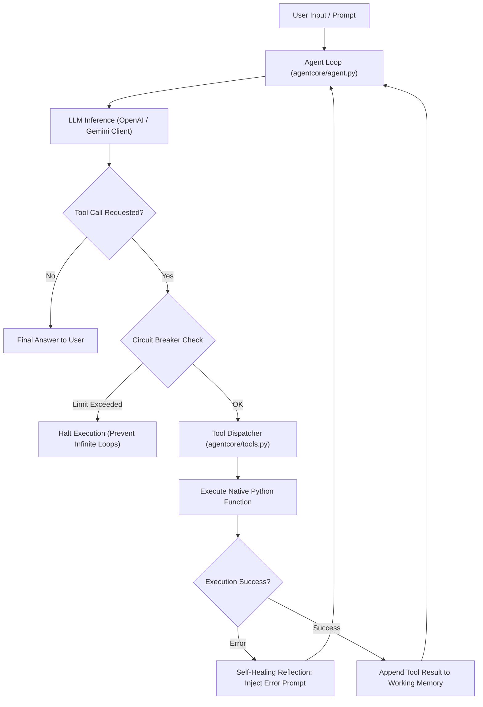

# 🧠 Agent Core: Building an Autonomous AI Agent From Scratch

[](https://www.python.org/)
[]()
[](https://ai.google.dev/)
[]()

> **Day 1 — Agentic AI Track**  
> Understanding foundational AI agent architecture by building the core loop, tool schemas, memory, self-healing reflection, and evaluation harnesses from first principles without high-level black-box frameworks.

---

## 📌 The Problem (What the Mentors Gave Me)

High-level agent frameworks (like LangChain, AutoGen, or CrewAI) often obscure what actually happens inside an LLM agent:
- How does an LLM decide when to call a tool versus responding with plain text?
- How are JSON schemas extracted from native Python function signatures and type annotations?
- What prevents an agent from entering infinite retry loops or burning quota when a tool fails?
- How do stateful conversations, working memory, and session threads persist?

The challenge was to **demystify the entire agent lifecycle** by constructing `agentcore` from pure Python and low-level API calls—implementing the ReAct (Reason + Act) loop, tool registries, execution engines, circuit breakers, and LLM-as-a-judge evaluators from scratch.

---

## 💡 My Solution & Architecture (What I Built)

I built **`agentcore`**, a lightweight, modular, and transparent agent runtime that exposes every step of the agent execution lifecycle:



---

## 🛠️ What I Used (Tech Stack)

- **Core Language**: Python 3.10+ (Standard Library: `ast`, `inspect`, `json`, `sqlite3`, `typing`)
- **LLM Connectivity**: `openai` client (targeted at Google Gemini OpenAI-compatible endpoints or NVIDIA NIM)
- **Evaluation Framework**: `deepeval` / custom LLM-as-a-Judge evaluators
- **Environment Management**: `python-dotenv`

---

## ✨ Features & What I Built

### 1. Zero-Framework Tool Registry (`agentcore/tools.py`)
- Automatically parses Python function signatures, docstrings, and type hints into strict **OpenAI-compatible JSON Tool Schemas**.
- Handles argument validation, type coercion, and execution safety.

### 2. Autonomous ReAct Execution Loop (`agentcore/agent.py`)
- Dispatches tool calls, captures return payloads, injects tool outputs into the conversation scratchpad, and resumes the model until a terminal answer is reached.

### 3. Self-Healing Error Recovery (`labs/lab4_self_healing.py`)
- When a tool fails (e.g., invalid parameters, database missing key), the agent does not crash. It feeds the raw traceback back to the LLM, prompting it to correct its parameters and retry.

### 4. Circuit Breaker Pattern (`exercises/ex3_circuit_breaker.py`)
- Enforces strict execution safety guards (maximum iteration limits, duplicate call detection, and token budget thresholds) to prevent runaway costs and infinite loops.

### 5. Memory & Session Management (`agentcore/memory.py`, `labs/lab5_memory.py`)
- Working memory for immediate tool scratchpads.
- Thread-isolated session memory for multi-turn conversations.

### 6. LLM-as-a-Judge Evaluation (`exercises/ex4_evaluator_own_task.py`)
- Automated grading harness that measures agent response relevancy, tool choice correctness, and factual faithfulness against ground-truth benchmarks.

---

## 📂 Project Structure

```text
sodak-day1/
├── agentcore/                   # Core agent runtime built from scratch
│   ├── __init__.py
│   ├── agent.py                 # The autonomous ReAct execution loop
│   ├── config.py                # Model and environment configurations
│   ├── demo_tools.py            # Sample calculators and lookup tools
│   ├── memory.py                # Working memory and context window management
│   ├── patterns.py              # Reflection, routing, and planning patterns
│   ├── tools.py                 # JSON schema generator & tool dispatcher
│   └── tracing.py               # Step-by-step execution logger
├── labs/                        # Hands-on progressive labs
│   ├── lab1_first_call.py       # Direct LLM invocation & response handling
│   ├── lab2_tools.py            # Tool calling & JSON schema validation
│   ├── lab3_agent.py            # Autonomous ReAct agent implementation
│   ├── lab4_self_healing.py     # Error reflection & recovery loop
│   ├── lab5_memory.py           # Conversational memory persistence
│   └── lab6_patterns.py         # Advanced agent architectures
├── exercises/                   # Applied engineering exercises
│   ├── ex1_side_effect_tool.py  # Tools that modify persistent state
│   ├── ex2_session_memory.py    # Multi-session thread isolation
│   ├── ex3_circuit_breaker.py   # Guardrails against infinite tool loops
│   └── ex4_evaluator_own_task.py# LLM-as-a-judge evaluation harness
├── requirements.txt
├── setup_check.py               # Diagnostic script for environment verification
└── README.md
```

---

## 🚀 How to Run & Test

### 1. Setup Environment
```bash
python -m venv .venv
.venv\Scripts\activate       # On Linux/macOS: source .venv/bin/activate
pip install -r requirements.txt
```

### 2. Configure API Key
Create a `.env` file in the root folder:
```bash
GEMINI_API_KEY=your_gemini_api_key_here
```

### 3. Run Diagnostic Check
```bash
python setup_check.py
```

### 4. Run the Labs & Exercises
```bash
# Run the autonomous ReAct agent
python -m labs.lab3_agent

# Run self-healing error recovery
python -m labs.lab4_self_healing

# Run circuit breaker guardrails
python -m exercises.ex3_circuit_breaker

# Run LLM-as-a-judge evaluation
python -m exercises.ex4_evaluator_own_task
```

---

## 📜 License
MIT License
